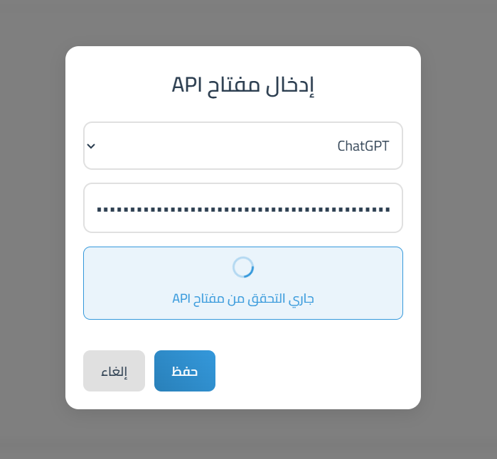

# Integrated AI Chat Interface / واجهة الدردشة الذكية المتكاملة

[English](#english) | [العربية](#arabic)

## <a name="english">English</a>

An advanced user interface for interacting with multiple AI models (ChatGPT, Claude, Gemini) in a unified and elegant interface.




## Features

### Model Management
- Multi-model support: ChatGPT, Claude, Gemini
- Easy model addition and removal
- Automatic API key validation
- Seamless switching between models

### User Interface
- Modern and elegant design
- Dark/Light mode
- Animated loading indicators
- Smooth transitions
- Seamless scrolling
- Responsive user experience

### Security
- Secure API key storage in Local Storage
- API key validation
- Clear error messages

## Requirements
- API key for each model you want to use:
  - ChatGPT: OpenAI API key
  - Claude: Anthropic API key
  - Gemini: Google AI API key

## How to Use

1. **Adding a Model**
   - Click the "Add Model" button
   - Select the desired model
   - Enter your API key
   - Wait for key validation

2. **Sending Messages**
   - Select the model you want to use
   - Type your message in the text box
   - Click send or press Enter

3. **Customizing the Interface**
   - Use the theme toggle to switch between dark and light modes
   - Your preferences are automatically saved

## Security & Privacy
- API keys are stored in browser's Local Storage
- No API keys are shared with external servers
- Keys are validated directly with official API endpoints

## Project Structure
```
├── index.html      # Main page structure
├── style.css       # CSS styles
├── script.js       # JavaScript logic
├── README.md       # English documentation
└── README_ar.md    # Arabic documentation
```

## Recent Updates
- Improved header design and organization
- Added smooth scrolling without visible scrollbar
- Improved control button positioning and sizing
- Enhanced dark/light mode user experience

## Code Organization

### JavaScript (script.js)
- `ChatInterface` class manages all functionality
- Methods are organized by feature:
  - Model management
  - Theme handling
  - API interactions
  - UI updates

### CSS (style.css)
- Organized by components:
  - Core variables and themes
  - Layout structure
  - Header components
  - Chat interface
  - Modal and forms

### HTML (index.html)
- Clean semantic structure
- Modular component organization
- Responsive layout design

## License 
This project is licensed under the MIT License - see the LICENSE file for details.

---

## <a name="arabic">العربية</a>

واجهة متقدمة للتفاعل مع نماذج الذكاء الاصطناعي المتعددة (ChatGPT، Claude، Gemini) في واجهة موحدة وأنيقة.


### الميزات

#### إدارة النماذج
- دعم نماذج متعددة: ChatGPT، Claude، Gemini
- إضافة وإزالة النماذج بسهولة
- التحقق التلقائي من مفتاح API
- التبديل السلس بين النماذج

#### واجهة المستخدم
- تصميم عصري وأنيق
- وضع داكن/فاتح
- مؤشرات تحميل متحركة
- انتقالات سلسة
- تمرير سلس
- تجربة مستخدم متجاوبة

#### الأمان
- تخزين آمن لمفاتيح API في التخزين المحلي
- التحقق من مفتاح API
- رسائل خطأ واضحة

### المتطلبات
- مفتاح API لكل نموذج ترغب في استخدامه:
  - ChatGPT: مفتاح OpenAI API
  - Claude: مفتاح Anthropic API
  - Gemini: مفتاح Google AI API

### كيفية الاستخدام

1. **إضافة نموذج**
   - انقر على زر "إضافة نموذج"
   - اختر النموذج المطلوب
   - أدخل مفتاح API الخاص بك
   - انتظر التحقق من المفتاح

2. **إرسال الرسائل**
   - اختر النموذج الذي تريد استخدامه
   - اكتب رسالتك في مربع النص
   - انقر على إرسال أو اضغط Enter

3. **تخصيص الواجهة**
   - استخدم زر التبديل للتحول بين الوضع الداكن والفاتح
   - يتم حفظ تفضيلاتك تلقائيًا

### الأمان والخصوصية
- يتم تخزين مفاتيح API في التخزين المحلي للمتصفح
- لا يتم مشاركة مفاتيح API مع خوادم خارجية
- يتم التحقق من المفاتيح مباشرة مع نقاط النهاية الرسمية للـ API

### هيكل المشروع
```
├── index.html      # هيكل الصفحة الرئيسية
├── style.css       # أنماط CSS
├── script.js       # منطق JavaScript
├── README.md       # توثيق باللغة الإنجليزية
└── README_ar.md    # توثيق باللغة العربية
```

### التحديثات الأخيرة
- تحسين تصميم وتنظيم الرأس
- إضافة تمرير سلس بدون شريط تمرير مرئي
- تحسين موضع وحجم أزرار التحكم
- تحسين تجربة المستخدم للوضع الداكن/الفاتح

### تنظيم الكود

#### JavaScript (script.js)
- فئة `ChatInterface` تدير جميع الوظائف
- يتم تنظيم الأساليب حسب الميزة:
  - إدارة النماذج
  - معالجة المظهر
  - تفاعلات API
  - تحديثات واجهة المستخدم

#### CSS (style.css)
- منظم حسب المكونات:
  - المتغيرات والمظاهر الأساسية
  - هيكل التخطيط
  - مكونات الرأس
  - واجهة الدردشة
  - النماذج والمودال

#### HTML (index.html)
- هيكل دلالي نظيف
- تنظيم مكون وحدوي
- تصميم تخطيط متجاوب

### الترخيص
هذا المشروع مرخص بموجب رخصة MIT - راجع ملف LICENSE للتفاصيل.