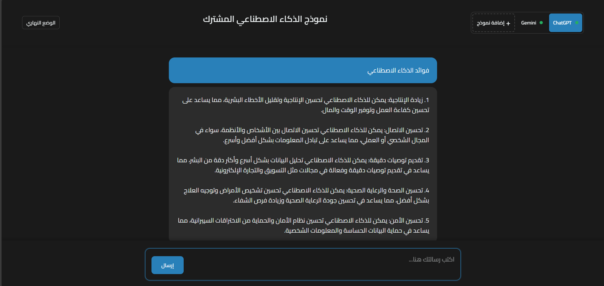

# واجهة الذكاء الاصطناعي المتكاملة

واجهة مستخدم متقدمة للتفاعل مع نماذج الذكاء الاصطناعي المختلفة (ChatGPT، Claude، Gemini) في واجهة موحدة وأنيقة.



## المميزات

### إدارة النماذج
- دعم متعدد النماذج: ChatGPT، Claude، Gemini
- إضافة وإزالة النماذج بسهولة
- التحقق التلقائي من صلاحية مفاتيح API
- التبديل السلس بين النماذج المختلفة

### واجهة المستخدم
- تصميم عصري وأنيق
- وضع ليلي/نهاري
- مؤشرات تحميل متحركة
- تأثيرات انتقالية سلسة
- دعم التمرير السلس
- تجربة مستخدم متجاوبة

### الأمان
- تخزين آمن لمفاتيح API في Local Storage
- التحقق من صحة مفاتيح API
- رسائل خطأ واضحة باللغة العربية

## المتطلبات
- مفتاح API لكل نموذج تريد استخدامه:
  - ChatGPT: مفتاح OpenAI API
  - Claude: مفتاح Anthropic API
  - Gemini: مفتاح Google AI API

## كيفية الاستخدام

1. **إضافة نموذج**
   - انقر على زر "إضافة نموذج"
   - اختر النموذج المطلوب
   - أدخل مفتاح API الخاص بك
   - انتظر التحقق من صحة المفتاح

2. **إرسال رسائل**
   - اختر النموذج الذي تريد استخدامه
   - اكتب رسالتك في مربع النص
   - اضغط على زر الإرسال أو اضغط Enter

3. **تخصيص الواجهة**
   - استخدم زر تبديل الوضع للتبديل بين الوضع الليلي والنهاري
   - يتم حفظ تفضيلاتك تلقائياً

## الأمان والخصوصية
- يتم تخزين مفاتيح API في Local Storage المتصفح
- لا يتم مشاركة مفاتيح API مع أي خوادم خارجية
- يتم التحقق من صحة المفاتيح مباشرة مع واجهات API الرسمية

## هيكل المشروع
```
├── index.html      # هيكل الصفحة الرئيسية
├── style.css       # أنماط CSS
├── script.js       # منطق JavaScript
├── README.md       # التوثيق بالإنجليزية
└── README_ar.md    # التوثيق بالعربية
```

## التحديثات الأخيرة
- تحسين تصميم الهيدر وتنظيمه
-  تمرير سلس بدون شريط تمرير ظاهر
- تحسين موضع وحجم أزرار التحكم
- تحسين تجربة المستخدم في الوضع الليلي/النهاري

## الترخيص 📝
هذا المشروع مرخص تحت رخصة MIT - انظر ملف [LICENSE](LICENSE) لمزيد من التفاصيل.